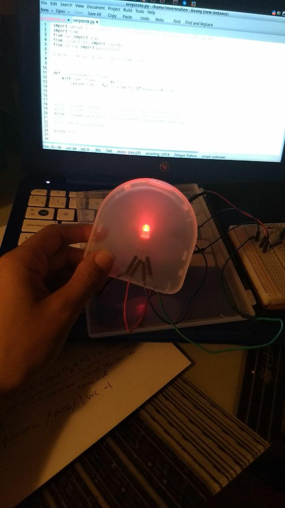

# Did you know we are fucked? No?
## No problem, discover on your own

This stupid but fun to do device uses the technology in Arduino, Python and bro.org tool to make you think about censorship in other countries. Did you know some countries don't allow using twitter, facebook or even wikipedia?

If someone in the network connects to any of this more than 3 times, the led will glow in red, which will remind you, you are so lucky you are able to connect to them in your current location.

I made this device for a speech I'm giving in September about internet censorship. It's on diapers, and I'm willing to improve it. Feel fre to fork, suggest and use this device as you wish, even better if you keep the toy's philosophy regarding internet censorship. 

